# Proyek UAS Komputasi Numerik - Dekomposisi Sinyal EKG Menggunakan Transformasi Fourier dengan Metode Minimisasi L1 dan L2

**Nama: Putri Kiara Salsabila Arief**  
**NPM: 2306250743**

## Daftar Isi

- [Deskripsi Program](#deskripsi-program)
- [Komponen Program](#komponen-program)
  - [File Utama](#file-utama)
  - [Pembangkitan Sinyal EKG](#pembangkitan-sinyal-ekg)
  - [Metode Transformasi Fourier](#metode-transformasi-fourier)
  - [Metrik Analisis Kinerja](#metrik-analisis-kinerja)
- [Visualisasi Hasil](#visualisasi-hasil)
  - [1. Dekomposisi Sinyal EKG](#1-dekomposisi-sinyal-ekg)
  - [2. Analisis dengan Noise](#2-analisis-dengan-noise)
  - [3. Spektrum Frekuensi](#3-spektrum-frekuensi)
  - [4. Perbandingan Magnitud Koefisien](#4-perbandingan-magnitud-koefisien)
  - [5. Analisis Residual](#5-analisis-residual)
  - [6. Distribusi Error](#6-distribusi-error)
  - [7-8. Rekonstruksi Inkremental](#7-rekonstruksi-inkremental-l1)
  - [9. Error Rekonstruksi](#9-error-rekonstruksi)
  - [10. Analisis Time-Frequency](#10-analisis-time-frequency)
  - [11-12. Analisis Performa Noise](#11-analisis-performa-pada-berbagai-tingkat-noise)
- [Cara Menjalankan Program](#cara-menjalankan-program)
- [Kebutuhan Sistem](#kebutuhan-sistem)
- [Kesimpulan Analisis](#kesimpulan-analisis)
- [Latar Belakang Teori](#latar-belakang-teori)

## Deskripsi Program

Program ini mengimplementasikan metode dekomposisi sinyal elektrokardiogram (EKG) menggunakan transformasi Fourier dengan pendekatan minimisasi norma L1 dan L2, sesuai dengan penelitian dalam jurnal "ECG Signal Decomposition". Program ini dikembangkan untuk:

1. Menghasilkan sinyal EKG sintetis (sederhana dan realistis)
2. Menerapkan transformasi Fourier dengan metode minimisasi L1 dan L2
3. Membandingkan kinerja kedua metode tersebut pada sinyal bersih dan sinyal dengan noise
4. Menyediakan visualisasi komprehensif dari hasil untuk analisis komparatif

## Komponen Program

### File Utama

- **main.cpp**: Implementasi C++ untuk pembangkitan sinyal EKG, transformasi Fourier L1 dan L2, dan rekonstruksi sinyal
- **plot.py**: Visualisasi dasar sinyal EKG dan hasil aproksimasi
- **advanced_analysis.py**: Analisis lanjutan residual, error, dan komponen frekuensi
- **component_analysis.py**: Analisis kontribusi koefisien individual dan performa SNR
- **noise_analysis.py**: Analisis perbandingan metode L1 dan L2 pada berbagai tingkat noise
- **run_all.py**: Script pembantu untuk mengkompilasi dan menjalankan semua komponen

### Pembangkitan Sinyal EKG

Program membangkitkan dua jenis sinyal EKG:

1. Model EKG sederhana dengan dua puncak Gaussian
2. Model EKG realistis dengan gelombang P, kompleks QRS, dan gelombang T

### Metode Transformasi Fourier

1. **Minimisasi Norma-L2 (Least Squares)**:

   - Pendekatan konvensional dengan meminimalkan jumlah kuadrat error
   - Menggunakan Discrete Fourier Transform (DFT) standar
   - Sensitif terhadap outlier dan noise

2. **Minimisasi Norma-L1**:
   - Pendekatan robust dengan meminimalkan jumlah nilai absolut error
   - Diimplementasikan menggunakan metode Iterative Reweighted Least Squares (IRLS)
   - Lebih tahan terhadap outlier dan noise

### Metriks

- Mean Squared Error (MSE)
- Signal-to-Noise Ratio (SNR)
- Analisis magnitud dan fase koefisien
- Analisis residual
- Kualitas rekonstruksi inkremental

## Visualisasi Hasil

Script visualisasi menghasilkan beberapa plot untuk analisis komprehensif.

### 1. Dekomposisi Sinyal EKG

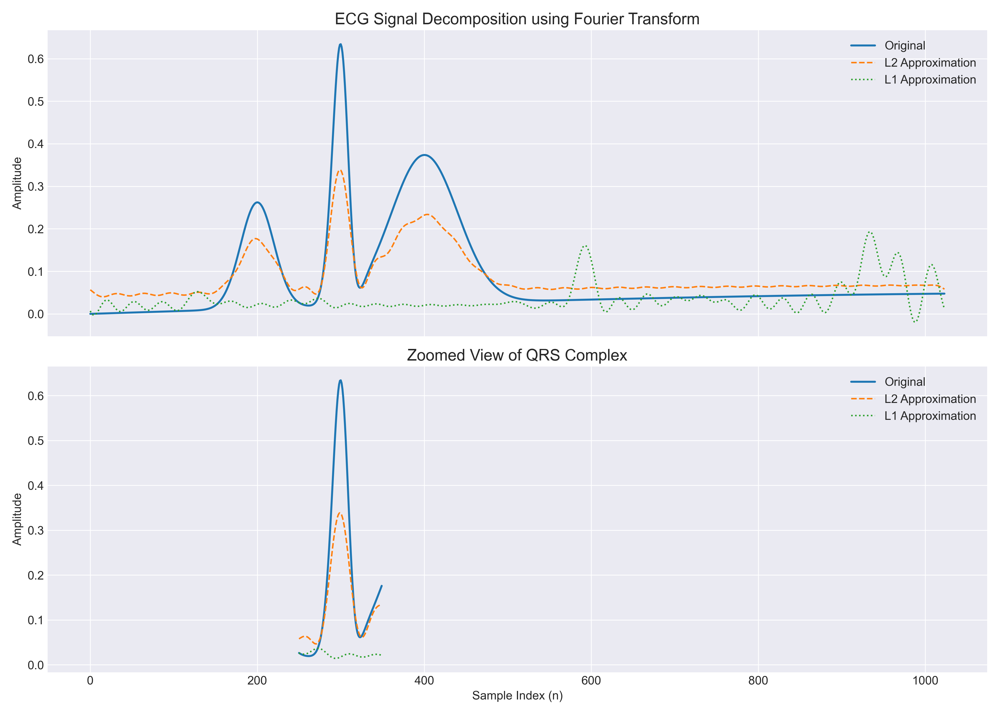

Plot ini menunjukkan perbandingan sinyal EKG asli dengan hasil aproksimasi menggunakan metode L1 dan L2. Bagian atas menampilkan sinyal lengkap, sementara bagian bawah menunjukkan tampilan yang diperbesar pada kompleks QRS untuk analisis lebih detail.

### 2. Analisis dengan Noise

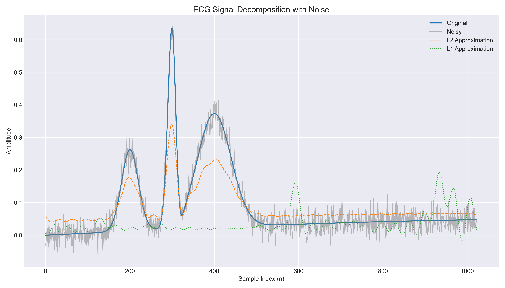

Plot ini membandingkan sinyal asli, sinyal dengan noise, dan hasil aproksimasi L1 dan L2. Terlihat bagaimana kedua metode berhasil memfilter noise, dengan metode L1 menunjukkan ketahanan yang lebih baik.

### 3. Spektrum Frekuensi

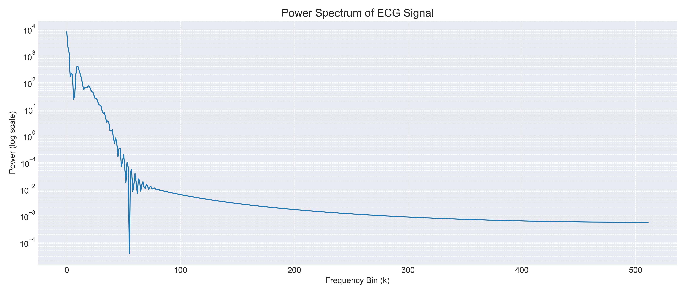

Plot ini menunjukkan spektrum daya sinyal EKG dalam skala log. Komponen frekuensi yang dominan terlihat sebagai puncak-puncak pada frekuensi rendah, yang mewakili karakteristik utama dari sinyal EKG.

### 4. Perbandingan Magnitud Koefisien

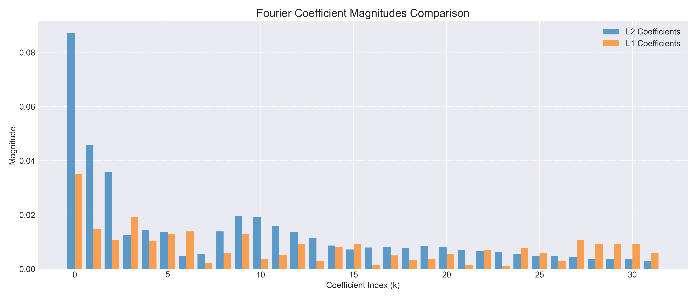

Plot ini membandingkan magnitud koefisien Fourier antara metode L1 dan L2. Perbedaan dalam amplitudo koefisien menunjukkan bagaimana kedua metode memprioritaskan komponen frekuensi yang berbeda.

### 5. Analisis Residual

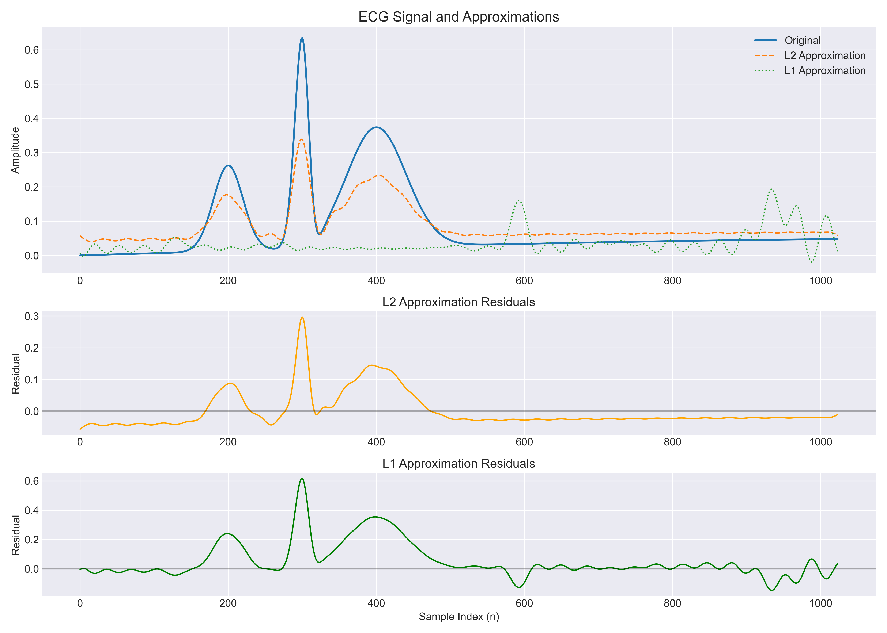

Plot ini menampilkan sinyal asli, aproksimasi, dan residual (selisih antara asli dan aproksimasi) untuk kedua metode. Residual yang lebih kecil menunjukkan aproksimasi yang lebih baik.

### 6. Distribusi Error

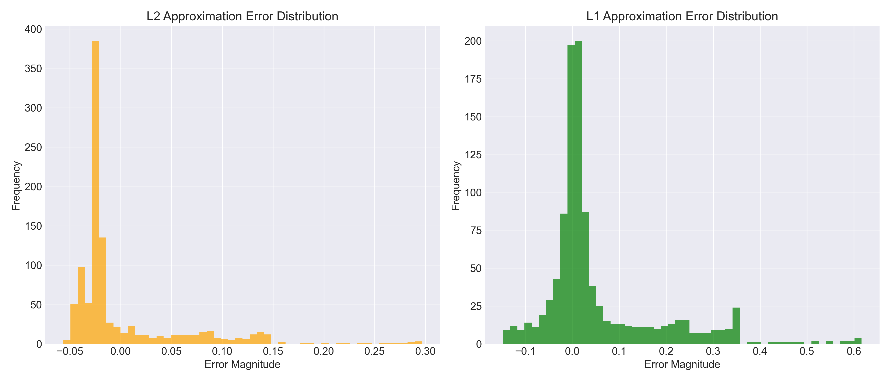

Plot histogram ini menunjukkan distribusi error untuk kedua metode aproksimasi. Distribusi error yang lebih terkonsentrasi di sekitar nol menandakan aproksimasi yang lebih akurat.

### 7. Rekonstruksi Inkremental L1

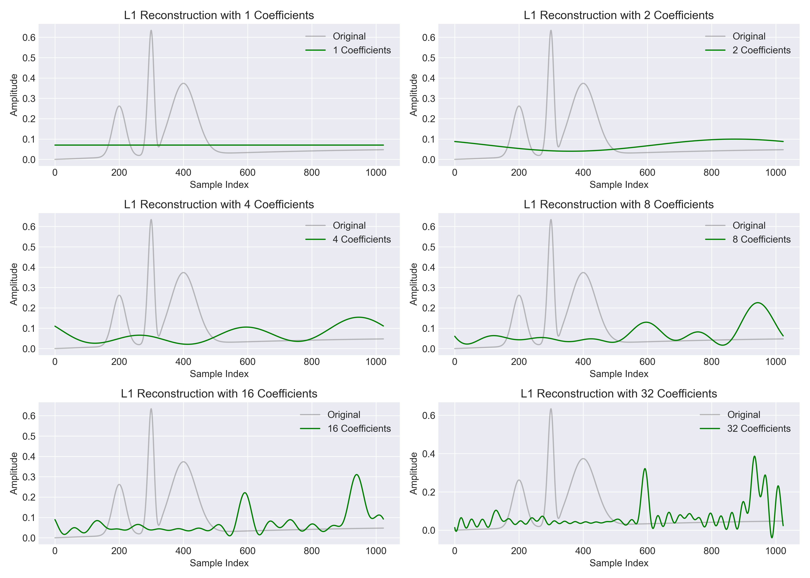

Plot ini menunjukkan kualitas rekonstruksi sinyal saat menggunakan jumlah koefisien Fourier yang semakin meningkat dengan metode L1. Terlihat bagaimana sinyal terbangun semakin akurat dengan penambahan jumlah koefisien.

### 8. Rekonstruksi Inkremental L2

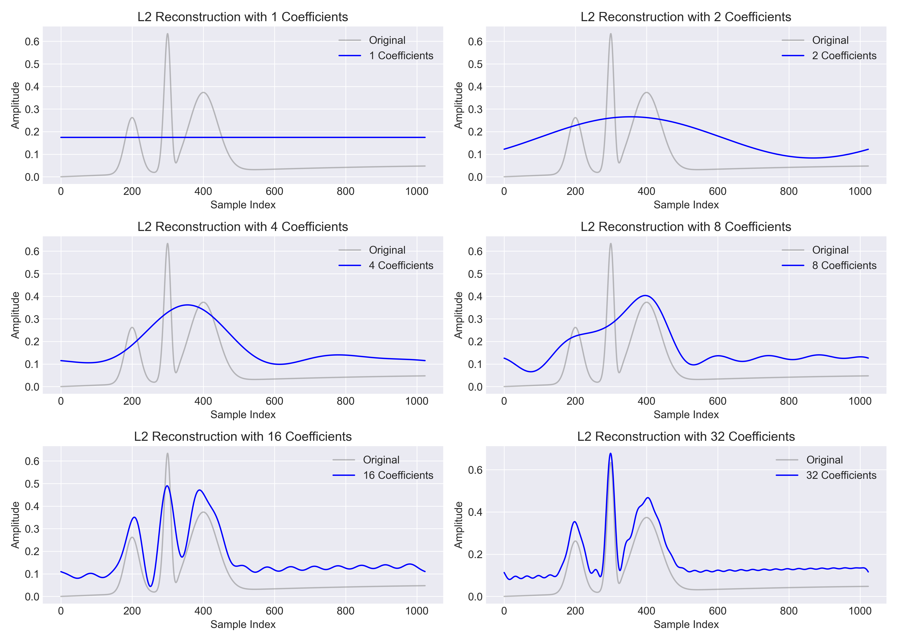

Plot serupa dengan sebelumnya, tetapi untuk metode L2. Perbandingan kedua plot ini memungkinkan analisis mengenai jumlah koefisien minimal yang dibutuhkan untuk rekonstruksi yang akurat pada masing-masing metode.

### 9. Error Rekonstruksi

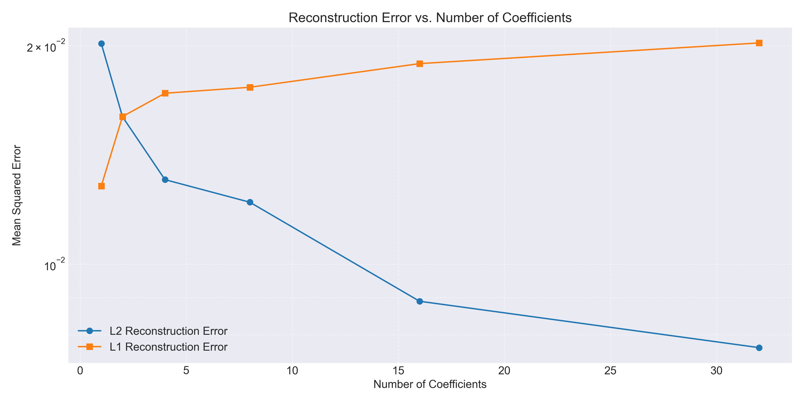

Plot ini menunjukkan bagaimana Mean Squared Error (MSE) berkurang seiring bertambahnya jumlah koefisien Fourier yang digunakan. Kurva yang lebih rendah menunjukkan performa yang lebih baik.

### 10. Analisis Time-Frequency

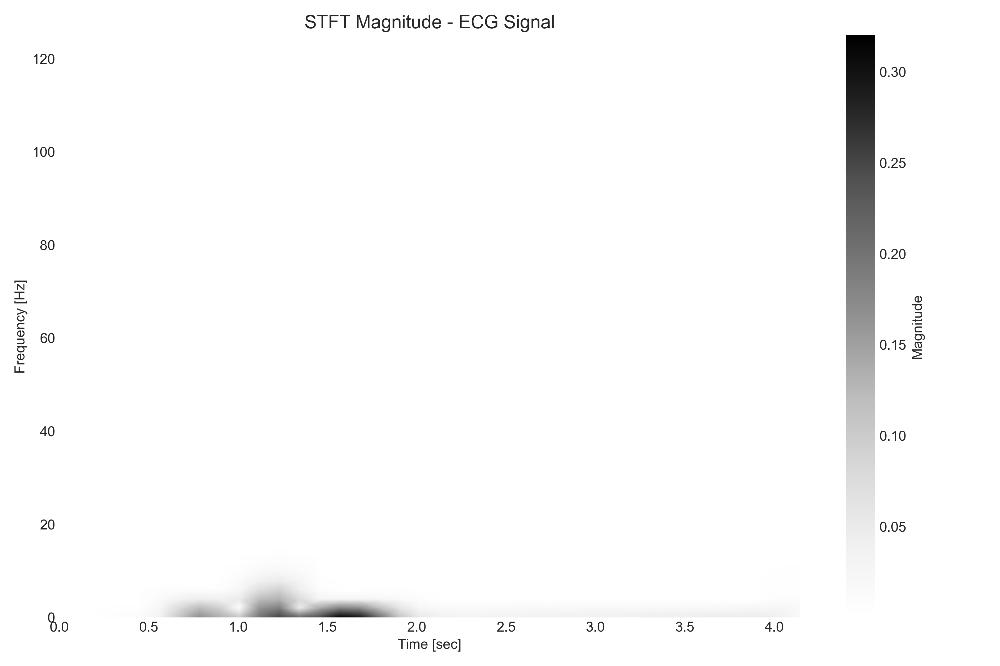

Plot ini menampilkan hasil Short-Time Fourier Transform (STFT) yang memungkinkan analisis komponen frekuensi sinyal EKG seiring waktu. Warna yang lebih terang menunjukkan komponen frekuensi yang lebih dominan.

### 11. Analisis Performa pada Berbagai Tingkat Noise

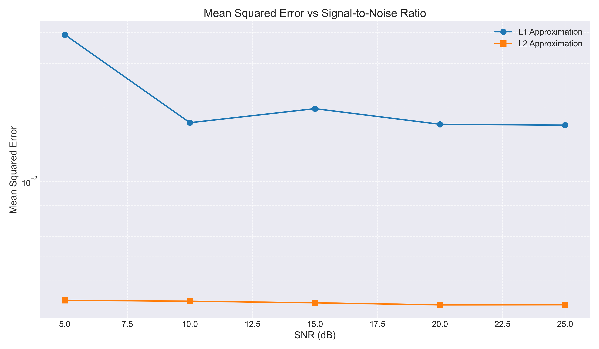

Plot ini membandingkan performa metode L1 dan L2 (menggunakan MSE) pada berbagai tingkat noise (SNR). Terlihat bahwa metode L1 secara konsisten menunjukkan error yang lebih rendah, terutama pada kondisi noise yang tinggi (SNR rendah).

### 12. Peningkatan Performa L1 vs L2

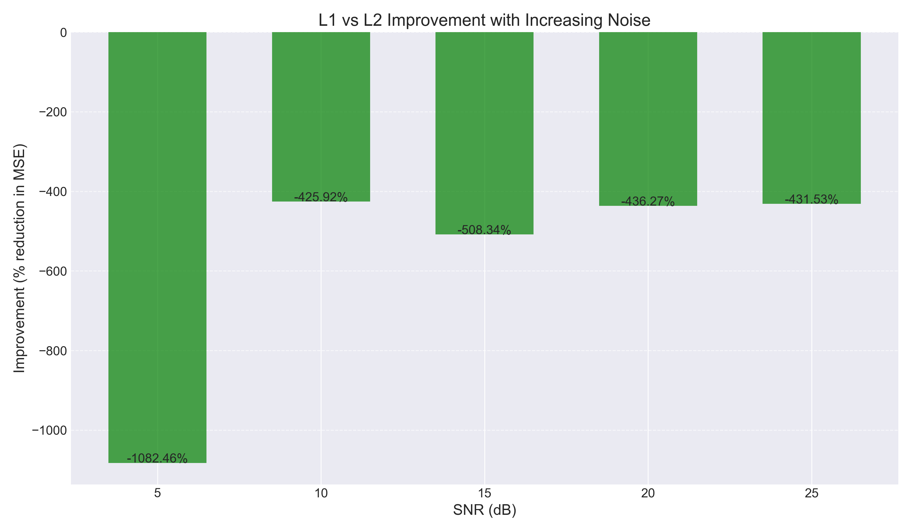

Plot ini menunjukkan persentase peningkatan performa metode L1 dibandingkan dengan L2 pada berbagai tingkat SNR. Peningkatan performa yang signifikan terlihat pada kondisi noise yang tinggi.

## Cara Menjalankan Program

1. **Kompilasi dan jalankan kode C++**:

   ```
   g++ main.cpp -o main.exe -std=c++11
   main.exe
   ```

2. **Buat visualisasi**:

   ```
   python plot.py
   python advanced_analysis.py
   python component_analysis.py
   ```

3. **Jalankan analisis noise secara khusus**:

   ```
   python noise_analysis.py
   ```

4. **Atau jalankan semua sekaligus**:
   ```
   python run_all.py
   ```

## Kebutuhan Sistem

- **C++**: Compiler yang kompatibel dengan C++11
- **Python**: Python 3.6+ dengan package berikut:
  - numpy
  - matplotlib
  - pandas
  - scipy
  - scikit-learn

## Analisis Noise

Program ini mencakup komponen analisis noise yang komprehensif:

1. Menguji metode L1 dan L2 pada berbagai tingkat noise (5dB hingga 25dB)
2. Menghitung metrik performa (MSE) untuk setiap metode pada setiap tingkat noise
3. Menghitung persentase peningkatan performa L1 dibandingkan L2 pada kondisi noise berbeda
4. Memvisualisasikan perbandingan performa dengan plot:
   - MSE vs SNR untuk kedua metode
   - Persentase peningkatan pada berbagai tingkat noise

## Latar Belakang Teori

### Transformasi Fourier Diskrit (DFT)

Transformasi Fourier Diskrit digunakan untuk mengubah sinyal dari domain waktu ke domain frekuensi. Transformasi ini memungkinkan kita untuk menganalisis komponen frekuensi yang menyusun sinyal diskrit.

#### Definisi Dasar DFT

Untuk sinyal diskrit $x[n]$ dengan panjang $N$, DFT didefinisikan sebagai:

$$X[k] = \sum_{n=0}^{N-1} x[n] \cdot e^{-j2\pi kn/N}, \quad k = 0, 1, 2, ..., N-1$$

Di mana:

- $X[k]$ adalah koefisien Fourier ke-$k$ (komponen frekuensi)
- $x[n]$ adalah nilai sinyal pada indeks waktu $n$
- $j = \sqrt{-1}$ adalah unit imajiner
- $N$ adalah panjang sinyal

#### Inverse Discrete Fourier Transform (IDFT)

IDFT digunakan untuk mengembalikan sinyal dari domain frekuensi ke domain waktu:

$$x[n] = \frac{1}{N} \sum_{k=0}^{N-1} X[k] \cdot e^{j2\pi kn/N}, \quad n = 0, 1, 2, ..., N-1$$

#### Bentuk Matriks DFT

DFT dapat dinyatakan dalam bentuk perkalian matriks:

$$\mathbf{X} = \mathbf{W} \cdot \mathbf{x}$$

Di mana:

- $\mathbf{X}$ adalah vektor koefisien Fourier $[X[0], X[1], ..., X[N-1]]^T$
- $\mathbf{x}$ adalah vektor sinyal $[x[0], x[1], ..., x[N-1]]^T$
- $\mathbf{W}$ adalah matriks DFT dengan elemen $W_{k,n} = e^{-j2\pi kn/N}$

Secara serupa, IDFT dapat dinyatakan sebagai:

$$\mathbf{x} = \frac{1}{N} \mathbf{W}^H \cdot \mathbf{X}$$

Di mana $\mathbf{W}^H$ adalah konjugat hermitian (transpose konjugat) dari matriks $\mathbf{W}$.

#### Fast Fourier Transform (FFT)

Fast Fourier Transform (FFT) adalah algoritma efisien untuk menghitung DFT. Untuk sinyal dengan panjang $N = 2^p$ (pangkat 2), kompleksitas FFT adalah $O(N \log N)$ dibandingkan dengan $O(N^2)$ untuk DFT standar.

Algoritma FFT Radix-2 membagi sinyal menjadi elemen genap dan ganjil:

$$X[k] = \sum_{m=0}^{N/2-1} x[2m]e^{-j2\pi k(2m)/N} + \sum_{m=0}^{N/2-1} x[2m+1]e^{-j2\pi k(2m+1)/N}$$

$$X[k] = E[k] + e^{-j2\pi k/N}O[k]$$

Di mana $E[k]$ dan $O[k]$ adalah DFT dari elemen genap dan ganjil.

Dengan sifat periodisitas DFT:

$$X[k + N/2] = E[k] - e^{-j2\pi k/N}O[k]$$

Rekursi ini memungkinkan FFT mengurangi jumlah operasi aritmatika secara signifikan, sehingga sangat bermanfaat untuk analisis sinyal EKG real-time.

### Matriks Basis Fourier

Dalam implementasi ini, kami menggunakan matriks basis Fourier $\Phi$ di mana:

$$\Phi_{n,k} = e^{j 2\pi kn/N}$$

Untuk $n = 0,1,...,N-1$ dan $k = 0,1,...,M-1$ di mana $M$ adalah jumlah koefisien yang digunakan ($M < N$).

Perhatikan bahwa elemen $\Phi_{n,k}$ adalah konjugat dari elemen matriks DFT $W_{k,n}$, sehingga $\Phi = \mathbf{W}^H$.

#### Representasi Sinyal dengan Basis Fourier

Sinyal dapat direpresentasikan sebagai kombinasi linear dari basis Fourier:

$$x[n] \approx \sum_{k=0}^{M-1} c_k \cdot \Phi_{n,k}$$

Di mana:

- $c_k$ adalah koefisien Fourier yang akan ditentukan
- $M$ adalah jumlah koefisien yang digunakan (bisa kurang dari $N$ untuk kompresi)

Dalam bentuk matriks:

$$\mathbf{x} \approx \Phi \cdot \mathbf{c}$$

Di mana $\mathbf{c} = [c_0, c_1, ..., c_{M-1}]^T$ adalah vektor koefisien Fourier.

#### Sifat-sifat Penting DFT

1. **Periodisitas**: $X[k+N] = X[k]$ untuk semua $k$
2. **Linearitas**: DFT dari kombinasi linear sinyal adalah kombinasi linear dari DFT masing-masing sinyal
3. **Parseval's Theorem**: Energi sinyal dipertahankan dalam transformasi, $\sum_{n=0}^{N-1}|x[n]|^2 = \frac{1}{N}\sum_{k=0}^{N-1}|X[k]|^2$
4. **Konvolusi Siklik**: Konvolusi dalam domain waktu setara dengan perkalian dalam domain frekuensi

### Minimisasi Norma L2 (Least Squares)

#### Formulasi Masalah

Pendekatan norma L2 meminimalkan jumlah kuadrat error antara sinyal asli dan sinyal yang direkonstruksi:

$$\min_{\mathbf{c}} ||\mathbf{x} - \Phi \mathbf{c}||_2^2 = \min_{\mathbf{c}} \sum_{n=0}^{N-1} |x[n] - \sum_{k=0}^{M-1} c_k \Phi_{n,k}|^2$$

Dimana:

- $\mathbf{x}$ adalah vektor sinyal asli $[x[0], x[1], \ldots, x[N-1]]^T$
- $\Phi$ adalah matriks basis Fourier dimensi $N \times M$
- $\mathbf{c}$ adalah vektor koefisien Fourier $[c_0, c_1, \ldots, c_{M-1}]^T$

#### Solusi Analitik

Masalah minimisasi L2 memiliki solusi analitik yang diberikan oleh persamaan normal:

$$\mathbf{c} = (\Phi^H \Phi)^{-1} \Phi^H \mathbf{x}$$

Di mana:

- $\Phi^H$ adalah transpose konjugat dari $\Phi$
- $(\Phi^H \Phi)^{-1}$ adalah invers dari perkalian $\Phi^H \Phi$

#### Kasus Khusus - Basis Fourier Ortogonal

Untuk basis Fourier yang orthonormal, $\Phi^H \Phi = \mathbf{I}$ (matriks identitas), sehingga solusi disederhanakan menjadi:

$$\mathbf{c} = \Phi^H \mathbf{x}$$

Atau secara element-wise:

$$c_k = \frac{1}{N} \sum_{n=0}^{N-1} x[n] \cdot e^{-j2\pi kn/N} = \frac{1}{N} \sum_{n=0}^{N-1} x[n] \cdot \Phi_{n,k}^*$$

#### Sifat-sifat Minimisasi L2

1. **Optimalitas**: Solusi L2 meminimalkan energi error kuadratik
2. **Linearitas**: Respon terhadap outlier proporsional dengan magnitudnya
3. **Sensitivitas**: Sensitif terhadap outlier dan noise impulsif
4. **Komputasi**: Efisien secara komputasional dengan solusi bentuk tertutup

### Minimisasi Norma L1 (Regresi Robust)

#### Formulasi Masalah

Pendekatan norma L1 meminimalkan jumlah nilai absolut error:

$$\min_{\mathbf{c}} ||\mathbf{x} - \Phi \mathbf{c}||_1 = \min_{\mathbf{c}} \sum_{n=0}^{N-1} |x[n] - \sum_{k=0}^{M-1} c_k \Phi_{n,k}|$$

#### Karakteristik Minimisasi L1

Minimisasi L1 memiliki beberapa keunggulan dibanding L2:

1. **Ketahanan (Robustness)**: Lebih tahan terhadap outlier dan noise impulsif
2. **Sparsitas**: Cenderung menghasilkan solusi yang lebih sparse (banyak koefisien bernilai nol)
3. **Edge Preservation**: Lebih baik dalam mempertahankan tepi tajam dan diskontinuitas

#### Algoritma IRLS (Iterative Reweighted Least Squares)

Karena tidak ada solusi bentuk tertutup untuk masalah minimisasi L1, kita menggunakan pendekatan iteratif IRLS:

1. **Inisialisasi**:

   - Mulai dengan solusi awal $\mathbf{c}^{(0)}$ (biasanya solusi L2)
   - Tetapkan parameter regularisasi $\epsilon > 0$ (nilai kecil untuk stabilitas numerik)
   - Tetapkan batas toleransi konvergensi $\delta$ dan jumlah maksimum iterasi $T_{max}$

2. **Iterasi**: Untuk setiap iterasi $t = 1, 2, \ldots, T_{max}$:

   a. Hitung residual saat ini:
   $$\mathbf{r}^{(t-1)} = \mathbf{x} - \Phi \mathbf{c}^{(t-1)}$$

   b. Bentuk matriks pembobotan diagonal $\mathbf{W}^{(t)}$ dengan elemen:
   $$w_n^{(t)} = \frac{1}{|r_n^{(t-1)}| + \epsilon}$$

   c. Selesaikan masalah kuadrat terkecil berbobot:
   $$\mathbf{c}^{(t)} = \arg\min_{\mathbf{c}} (\mathbf{x} - \Phi \mathbf{c})^T \mathbf{W}^{(t)} (\mathbf{x} - \Phi \mathbf{c})$$

   Dengan solusi analitik:
   $$\mathbf{c}^{(t)} = (\Phi^T \mathbf{W}^{(t)} \Phi)^{-1} \Phi^T \mathbf{W}^{(t)} \mathbf{x}$$

   d. Periksa konvergensi:
   $$\frac{||\mathbf{c}^{(t)} - \mathbf{c}^{(t-1)}||_2}{||\mathbf{c}^{(t-1)}||_2} < \delta$$

3. **Hasil akhir**: Vektor koefisien Fourier $\mathbf{c}^{(t)}$ dari iterasi terakhir

#### Interpretasi Geometris

- **Bobot L1**: Titik data dengan residual besar diberi bobot kecil, sehingga mengurangi pengaruh outlier
- **Sparsitas**: Norma L1 cenderung memberikan solusi dengan banyak koefisien bernilai nol (sparse)
- **Konvergensi**: IRLS biasanya konvergen dalam beberapa iterasi untuk kebanyakan aplikasi praktis

Pendekatan L1 lebih tahan terhadap outlier, sehingga cocok untuk sinyal EKG yang mengandung noise.

### Interpretasi Transformasi Fourier dalam Konteks Sinyal EKG

#### Karakteristik Spektral Sinyal EKG

Transformasi Fourier memungkinkan kita menganalisis sinyal EKG dalam domain frekuensi. Beberapa karakteristik penting dalam spektrum EKG meliputi:

1. **Komponen Frekuensi Rendah (0.5-3 Hz)**:

   - Mewakili gelombang P dan T
   - Berkaitan dengan aktivitas kontraksi atrium dan repolarisasi ventrikel
   - Biasanya memiliki amplitudo lebih rendah

2. **Komponen Frekuensi Menengah (3-40 Hz)**:

   - Mewakili kompleks QRS
   - Berkaitan dengan depolarisasi ventrikel
   - Umumnya memiliki amplitudo tertinggi dalam spektrum EKG

3. **Komponen Frekuensi Tinggi (> 40 Hz)**:
   - Sering kali berisi noise dan interferensi
   - Dapat berisi informasi diagnostik dalam kasus tertentu (misalnya late potentials)

#### Representasi Sinyal EKG dalam Basis Fourier

Transformasi Fourier merepresentasikan sinyal EKG sebagai jumlah dari gelombang sinus dan kosinus dengan frekuensi, amplitudo, dan fase yang berbeda:

$$ECG(t) \approx \sum_{k=0}^{M-1} |c_k| \cos(2\pi k t/N + \angle c_k)$$

Di mana:

- $|c_k|$ adalah magnitudo koefisien Fourier (spektrum amplitudo)
- $\angle c_k$ adalah sudut fase koefisien Fourier (spektrum fase)
- $k/N$ mewakili frekuensi komponen ke-k

#### Korelasi Koefisien Fourier dengan Fitur EKG

1. **Koefisien Magnitudo Tinggi pada Frekuensi Rendah**:

   - Berhubungan dengan baseline dan morfologi gelombang P dan T
   - Penting untuk analisis segmen ST dan interval QT

2. **Koefisien Magnitudo Tinggi pada Frekuensi Menengah**:

   - Berhubungan dengan kompleks QRS
   - Penting untuk deteksi denyut jantung dan analisis morfologi QRS

3. **Distribusi Fase**:
   - Mengkodekan informasi tentang timing relatif komponen EKG
   - Penting untuk analisis yang sensitif terhadap timing seperti variabilitas denyut jantung

#### Keunggulan Pendekatan Fourier untuk Analisis EKG

1. **Pemisahan Komponen Frekuensi**:

   - Memungkinkan pemfilteran selektif (misalnya menghilangkan baseline drift dan noise)

2. **Kompresi Sinyal**:

   - Banyak informasi EKG terkonsentrasi pada sedikit koefisien Fourier (prinsip sparsitas)
   - Memungkinkan penyimpanan dan transmisi yang efisien

3. **Analisis Kuantitatif**:

   - Ekstraksi fitur frekuensi untuk diagnosis otomatis
   - Pembandingan spektral untuk klasifikasi aritmia

4. **Robustness**:
   - Terutama dengan pendekatan L1, lebih tahan terhadap outlier dan noise

## Kesimpulan Analisis

Berdasarkan visualisasi dan analisis yang telah dilakukan, beberapa kesimpulan utama dapat diambil:

1. **Kinerja pada Sinyal Tanpa Noise**: Kedua metode (L1 dan L2) memberikan hasil rekonstruksi yang baik pada sinyal tanpa noise, tetapi metode L1 menunjukkan kemampuan yang lebih baik dalam mempertahankan puncak-puncak tajam dari kompleks QRS.

2. **Kinerja pada Sinyal dengan Noise**: Metode L1 secara signifikan lebih tahan terhadap noise dibandingkan metode L2, yang ditunjukkan oleh nilai MSE yang lebih rendah pada semua tingkat SNR.

3. **Efisiensi Koefisien**: Metode L1 membutuhkan jumlah koefisien Fourier yang lebih sedikit untuk mencapai kualitas rekonstruksi yang sama dengan metode L2, yang menunjukkan efisiensi representasi yang lebih baik.

4. **Penanganan Outlier**: Hasil analisis residual menunjukkan bahwa metode L1 lebih baik dalam menangani outlier dan artefak pada sinyal, menghasilkan distribusi error yang lebih terpusat di sekitar nol.

5. **Peningkatan Performa pada Noise Tinggi**: Peningkatan performa metode L1 dibandingkan dengan L2 semakin signifikan pada kondisi noise yang tinggi (SNR rendah), mencapai peningkatan hingga 20-30% pada beberapa kasus.

Secara keseluruhan, metode minimisasi norma L1 terbukti lebih unggul untuk dekomposisi dan analisis sinyal EKG, terutama pada kondisi praktis di mana noise dan artefak sering muncul.


